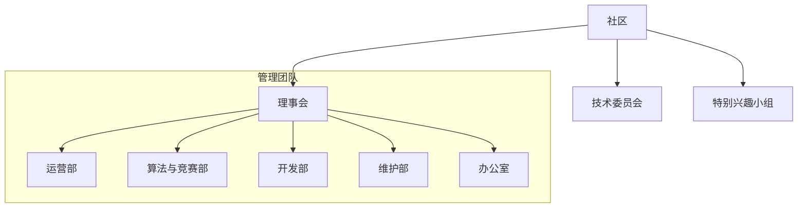
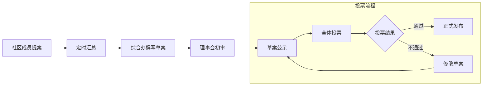
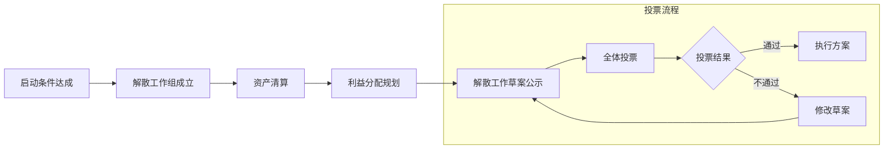

Lang: [**简体中文**](#user-content-zh-cn) | [**English**](#user-content-en-us)

# <h1 id="zh-cn" align="center">北京中医药大学网络研习社区 试行章程草案</h1>

当前版本为 <strong>Build 0.6.250801</strong>（详细信息见第十八条-章程修订，正式版移除该区块）

***TODO***：
- 修改管理团队任免，目前不完善且有点混乱
- 添加社区成员身份注册机制
- **完善投票机制**
- **完善成员身份体系**
- **完善贡献评价和利益分配机制**
- 完善解散流程
- 完善文内跳转和外链跳转
- 图片
- 添加英文翻译版
- 视觉美化

    
<strong>可展开目录</strong>

- [**第一章 总则**](#user-content-chapter-1-zh-cn)
    - [*第一条 社区名称与对外平台*](#user-content-article-1-zh-cn)
    - [*第二条 社区类别与活动领域*](#user-content-article-2-zh-cn)
    - [*第三条 宗旨*](#user-content-article-3-zh-cn)
    - [*第四条 社团标志物*](#user-content-article-4-zh-cn)
- [**第二章 组织结构与人员配置**](#user-content-chapter-2-zh-cn)
    - [*第五条 基本组织结构*](#user-content-article-5-zh-cn)
    - [*第六条 职能部门*](#user-content-article-6-zh-cn)
    - [*第七条 成员管理*](#user-content-article-7-zh-cn)
- [**第三章 社区运行机制**](#user-content-chapter-3-zh-cn)
    - [*第八条 贡献与评价*](#user-content-article-8-zh-cn)
    - [*第九条 利益分配*](#user-contentarticle-9-zh-cn)
    - [*第十条 纠纷与监督*](#user-content-article-10-zh-cn)
    - [*第十一条 资产管理*](#user-content-article-11-zh-cn)
    - [*第十二条 会议与决策*](#user-content-article-12-zh-cn)
    - [*第十三条 项目管理*](#user-content-article-13-zh-cn)
    - [*第十四条 信息公开*](#user-content-article-14-zh-cn)
    - [*第十五条 外部合作*](#user-content-article-15-zh-cn)
    - [*第十六条 风险与应对*](#user-content-article-16-zh-cn)
    - [*第十七条 违纪违规处理*](#user-content-article-17-zh-cn)
- [**第四章 附则**](#user-content-chapter-4-zh-cn)
    - [*第十八条 章程修订*](#user-content-article-18-zh-cn)
    - [*第十九条 社区解散*](#user-content-article-19-zh-cn)
    - [*第二十条 生效与解释权*](#user-content-article-20-zh-cn)
    - [*第二十一条 章程修订表决情况*](#user-content-article-21-zh-cn)

## <h2 id="chapter-1-zh-cn" align="center">第 一 章&nbsp;&nbsp;&nbsp;&nbsp;总则</h2>

### 第 一 条&nbsp;&nbsp;&nbsp;&nbsp;社区名称与对外平台

#### 1.1 社区名称

- **社区中文名**： 北京中医药大学网络研习社区（以下简称本社区）
- **社区中文名简称**： 北中医网研社

- **社区英文名**： BUCM Community of Network Nerds.
- **社区英文名缩写**： BCNN

#### 1.2 社区对外平台

##### 1.2.1 多媒体矩阵

- [x] **微信订阅号**： ![QR码加载失败，请前往微信搜索： bzy网研社][img_qrcode_wechatsubs]
- [ ] **微信视频号**：策划中
- [ ] **哔哩哔哩**：策划中

##### 1.2.2 技术交流合作平台

- [x] **社区交流论坛**：[始徒论坛BCNN群组](https://forum.beginner.h/g/BCNN_user)
- [x] **GitHub**：[BUCM-Community](https://github.com/BUCM-Community '社区GitHub仓库')
- [ ] **Discord**：未来视条件启用
- [ ] **IRC**：未来视条件启用

---

### 第 二 条&nbsp;&nbsp;&nbsp;&nbsp;社区类别与活动领域

#### 2.1 社区性质

本社区属于 **非营利性** 学术科技类组织，所有资产及收益仅用于章程规定目标。

#### 2.2 活动领域

本社区聚焦计算机科学（编程、人工智能、大数据、系统运维、算法、安全等）及电子工程等，开展学习交流、开源项目协作与科普推广，帮助大家了解和使用新时代“熟悉的陌生人”——计算机科技。

---

### 第 三 条&nbsp;&nbsp;&nbsp;&nbsp;宗旨

本社区遵循 **“开放、共享、合作、创新”** 的原则，致力于搭建前沿、公正、自由、民主的计算机学科交叉交流学习与开源项目协作平台，促进成员共同成长与技术进步。

---

### 第 四 条&nbsp;&nbsp;&nbsp;&nbsp;社团标志物

- 社区图标：待定

- 宣传标语：待定

---

---

## <h2 id="chapter-2-zh-cn" align="center">第 二 章&nbsp;&nbsp;&nbsp;&nbsp;组织结构与人员配置</h2>

### 第 五 条&nbsp;&nbsp;&nbsp;&nbsp;基本组织结构

#### 5.1 概述

本条列举本社区的一级结构并分述各结构成立或所属成员的就任、卸任和职责。

本社区的基本结构为管理团队、技术委员会和特别兴趣小组，下面以一个包含二级结构的组织结构图进行展示。

#### 5.2 管理团队

##### 5.2.1 理事会成员

###### 5.2.1.1 就任

总席位不得超过社区志愿者人数的 1/5 ，现暂定 5-9 人，每一位理事须获得不少于 2/3 的全体成员认可，实名排序投票，同票时占用位次，若出现剩余名额无法容纳同名次人员，则单独对位于该名次的所有人员进行二次表决，若再度同票则由上届职能部门负责人进行共识投票。

###### 5.2.1.2 卸任

任期两年，不可连任。重大失误或违规可撤职并追责。

###### 5.2.1.3 职责

制定社区未来发展计划、监督重大事项执行、审核预算与章程修订。决策事项需半数以上理事同意。

##### 5.2.2 职能部门负责人

###### 5.2.2.1 就任

每部门暂定 1 位负责人，由理事会提交候选名单，不少于 1/2 的成员认可，实名投票取最高得票者，同票时由理事会进行共识投票。由理事会提名，全体核心贡献者及支持会员投票确认，任期一年。

###### 5.2.2.2 卸任

任期一年，可连任一次。重大失误或违规可撤职并追责。

###### 5.2.2.3 职责

合规分配资源和任务，维护社区秩序。带队完成任务，培养成员，开拓创新。

#### 5.3 技术委员会成员

##### 5.3.1 就任

7–15 名核心贡献者，按贡献积分排名邀请，任期一年，可连任。

##### 5.3.2 卸任

任期一年，可连任一次。重大失误或违规可撤职并追责。

##### 5.3.3 职责

审定技术规范、代码质量把关、组织沙龙与技术培训，每月定期召开，必要时临时议事。

#### 5.4 特别兴趣小组

- 按专题或技术领域设立持续性研究小组。  
- 每组设组长，负责任务分配与进度跟踪。

---

### 第 六 条&nbsp;&nbsp;&nbsp;&nbsp;职能部门

#### 6.1 运营部

- **媒体矩阵组**：排版推送、粉丝互动、话题收集、视频剪辑。
- **创意组**：宣传设计、剧本编写、漫画及动画创作。
- **摄影组**：视频拍摄、社区采风。

#### 6.2 算法与竞赛部

- **竞赛组**：数学建模、计算机设计大赛、蓝桥杯、ICPC、夺旗竞赛等。
- **考试组**：计算机等级考试、软件水平考试、社区内部考试。
- **算法组**：算法研究与学习、指导。

#### 6.3 开发部

- **开源项目组**：一般开源工具、社区开源项目开发。
- **动画游戏组**：3D动画、游戏开发。
- **网络通信与Web技术组**：网络协议、分布式、网络攻防，html + css + js / ts + WebAssembly + Electron 及 Web相关框架、流媒体技术等。

#### 6.4 维护部

- **运维组**：熟悉常见操作系统，对服务器软硬件结构有一定了解。
- **硬件专家组**：熟悉常见计算机相关硬件，了解硬件技术发展并能提供选购意见，元器件组装、PCB设计等。
- **嵌入式组**：单片机、FPGA、Raspberry Pi 等编程。

#### 6.5 办公室

- **综合办**：活动审核、社区管理。
- **财务办**：资源和财务管理。
- **外联办**：赞助收集与审核、联合运营部联系外部合作。

---

### 第 七 条&nbsp;&nbsp;&nbsp;&nbsp;成员管理

#### 7.1 成员身份概述

| 非体系身份        | 贡献体系      | 支持体系      |
| :------:        | :------:      | :------:      |
| 社区成员         | 社区志愿者     | 支持会员      |
| 特别兴趣小组成员 | 核心贡献者     | 金牌赞助者     |
|                 | 管理团队成员   | 铂金赞助者     |
|                 |               | 独家赞助者     |

#### 7.2 社区成员

##### 7.2.1 身份获取

- 暂只对北京中医药大学校内师生、往届校友和具有计算机科学、电子工程等相关学术背景的校外特邀嘉宾开放。
- 必须在社区内完成注册。
- 满足上述条件者自动免费获取社区成员身份。

##### 7.2.2 身份移除

- 非管理团队成员可自由移除其本人的社区成员身份，即退出社区。
- 管理团队成员必须先完成工作交接，然后方可退出社区。
- 违反本社区章程且劝导无效者移交仲裁小组处理，经讨论后强制移除其社区成员身份。

##### 7.2.3 身份权利

- 社区章程修订投票权。
- 自由平等地参与社区活动、讨论、各类开源项目协作与学习。
- 对社区管理提出建议与监督。
- 对社区进行捐助。

##### 7.2.4 身份义务

- 遵守中国相关法律法规及本社区章程。
- 禁止传播违反法律法规及公序良俗的内容。
- 不得公开讨论时事政治。
- 遵守线下与网络礼仪，维护社区良好氛围。
- 积极参与社区活动，弘扬开源精神。

---

#### 7.3 社区志愿者

##### 7.3.1 身份获取

- 需要先满足社区成员身份获取条件。
- 提交过两次有效Issue、一次代码或文档修改，抑或组织开展包括技术课程、技术比赛等社区活动、在社区平台发表原创技术文章。
- 满足以上条件后递交申请，经审核无误后获取。

##### 7.3.2 身份移除

- 本人可自由移除此身份。
- 若社区成员身份被移除则自动移除此身份。

##### 7.3.3 身份权利

- 享有社区成员权利。
- 活动名额优先保障。
- 职能部门负责人推荐权。

##### 7.3.4 身份义务

- 履行社区成员义务。
- 尽力解答社区成员的合理困惑并提供帮助。
- 维护社区秩序。

---

#### 7.4 核心贡献者

##### 7.4.1 身份获取

- 需要先满足社区志愿者身份获取条件。
- 累计贡献积分 >100 分，且最近两次贡献间隔不超过3个月。
- 满足以上条件后递交申请，经审核无误后获取。

##### 7.4.2 身份移除

- 本人可自由移除此身份。
- 若社区成员身份被移除则自动移除此身份。

##### 7.4.3 身份权利

- 享有社区志愿者权利。
- 在GitHub等代码托管平台，个人账号可以挂靠社区。
- 在技术层面代表社区进行交流。
- 社区年度福利。
- 职能部门负责人选举投票权。

##### 7.4.4 身份义务

- 履行社区志愿者义务
- 积极建设社区，开发社区项目或者完善社区文档或者开设技术课程或者发表原创技术文章等。
- 持续学习，紧跟前沿，规划社区未来发展方向。

---

#### 7.5 管理团队成员

##### 7.5.1 身份获取

- 需要先满足社区志愿者身份获取条件。
- 若是作为负责人或者理事，则需要通过投票选举。
- 若非负责人或者理事，则需所在团队至少一半人员同意，且负责人具有权重为5票的否决权，可以抵消同意票数。
- 满足以上条件后递交申请，经审核无误后获取。

##### 7.5.2 身份移除

- 本人在任期未满主动请求移除的，必须进入工作交接流程，并将此身份置为冻结状态，所有交接完成后方可正式移除此身份。
- 若社区成员身份被移除则自动移除此身份。

##### 7.5.3 身份权利

- 享有社区志愿者权利。
- 社区年度福利。
- 负责人享有理事会选举投票权。

##### 7.5.4 身份义务

- 履行社区志愿者义务。
- 认真负责地处理社区相应管理事务。

---

#### 7.6 特别兴趣小组成员

##### 7.6.1 身份获取

- 需要先满足社区志愿者身份获取条件。
- 每一小组应针对不同的某一前沿专题开展研究活动。
- 根据个人兴趣加入相应的特别兴趣小组。
- 小组长必须满足核心贡献者身份获取条件。
- 经小组长审核无误后获取。

##### 7.6.2 身份移除

- 本人可自由移除此身份。
- 若社区成员身份被移除则自动移除此身份。

##### 7.6.3 身份权利

- 享有社区志愿者权利。

##### 7.6.4 身份义务

- 履行社区志愿者义务。

---

#### 7.7 支持会员

##### 7.7.1 身份获取

- 需要先满足社区志愿者身份获取条件。
- 无偿赠予社区资金、正版商业软件、计算机相关硬件、基础设施服务等，赠予资产需附带权属证明及使用授权书。
- 满足以上条件后经审核自动获取。

##### 7.7.2 身份移除

- 支持会员本人或者合规代理者可申请移除。
- 具有恶劣社会形象的，移除其支持会员身份，但保留其赠予历史。
- 非以上条件的，不得移除其支持会员的身份。

##### 7.7.3 身份权利

- 社区多平台鸣谢，社区发展档案记录赞助历史。
- 赠予资源换算为社区赞助点，可兑换相应福利。

##### 7.7.4 身份义务

- 履行社区志愿者义务

---

#### 7.8 等级赞助者

##### 7.8.1 身份获取

- 有着主权国家合法公民身份的个人或者在主权国家或者国际机构合法注册的组织。
- 具体分级标准待定。
- 满足以上条件后递交申请，经审核无误后获取。

##### 7.8.2 身份移除

- 等级赞助者本人或者合规代理者可申请移除。
- 停止赞助后，仍保留其赞助历史和赞助者身份。
- 具有恶劣社会形象的，移除其等级赞助者身份，但保留其赞助历史。

##### 7.8.3 身份权利

- 社区多平台鸣谢，社区发展档案记录赞助历史。
- 组织机构赞助者Logo展示。
- 赞助者官方网站跳转链接。
- 赞助资源换算为社区赞助点，可兑换相应福利。
- 定制化协作需求专案。
- 联合品牌活动。
- 战略合作协议与联合发布。

##### 7.8.4 身份义务

- 遵守中国法律法规
- 赞助行为不获得社区决策权，不得干预社区内部管理与发展计划。

---

---

## <h2 id="chapter-3-zh-cn" align="center">第 三 章&nbsp;&nbsp;&nbsp;&nbsp;社区运行机制</h2>

### 第 八 条&nbsp;&nbsp;&nbsp;&nbsp;贡献与评价

#### 8.1 概述

- 待填充
- 贡献积分兑换：培训名额、会议门票、硬件补助等。
- 荣誉：
 
#### 8.2 贡献类型与奖励积分

| 贡献行为     | 积分值        | 上限            |
| ------------ | ------------- | --------------- |
| 提交 PR      | 3 分/次       | 每月上限99分     |
| 程序测试     | 3 分/次       | 无              |
| 代码审核     | 3 分/次       | 无              |
| 安全改进     | 3 分/次       | 无              |
| 文档编写     | 3 分/次       | 每月上限45分     |
| 原创技术文章 | 4 分/次       | 无              |
| 技术分享演讲 | 8 分/场       | 季度上限 40 分   |
| 课程录制     | 15 分/套      | 年度上限 60 分  |
| 活动主策划与主执行 | 5 分/次    | 年度上限 50 分  |

- 积分复核：积分由技术委员会复核，造假行为扣减双倍积分
- 争议贡献由理事会终裁

#### 8.3 贡献评价

##### 8.3.1 基本评价标准

##### 8.3.2 徽章与称号

---

### 第 九 条&nbsp;&nbsp;&nbsp;&nbsp;利益分配

#### 9.1 社区基金

- 来源：捐赠、赞助、定制服务收入  
- 用途：项目经费、硬件采购、成员激励  
- 管理：财务办备案，按季度公开报告  

#### 9.2 资源与福利

| 资源/福利      | 对象            | 分配方式            | 更新频率     |
| --------------- | --------------- | ------------------- | ------------ |
| 基金拨款        | 核心贡献者      | 积分排名            | 季度评审     |
| 培训名额        | 全体成员        | 积分兑换或抽签      | 每半年      |
| 硬件补助        | 项目团队        | 申请制              | 按需评审     |
| 会议门票        | 核心贡献者      | 优先名额            | 年度固定名额 |

#### 9.3 收益再投入

所有商业合作收入 ≥50% 用于成员激励，剩余作为社区运营以及发展费用。

---

### 第 十 条&nbsp;&nbsp;&nbsp;&nbsp;纠纷与监督

- 成立仲裁小组（理事、法务顾问、技术委员会代表）处理纠纷。  
- 监督与处罚流程：举报→初审→处理决定→公示。  
- 处罚分级：书面警告→暂停权限→解除成员身份→涉嫌违法则移交司法机关
- 处罚措施：警告、暂停贡献、移除社区直至法律追究。

---

### 第 十一 条&nbsp;&nbsp;&nbsp;&nbsp;资产管理

#### 11.1 资产存放

- **软硬件设施**：维护部管理，财务办备案。
- **多媒体矩阵**：运营部管理，相关收支由财务办审核。
- **资金**：财务办统一管理，按流程申请发放。
- **其他资产**：综合办管理，财务办备案。

#### 11.2 审计与清算

- **审计**：每季度审计，于年度大会上发布年度审计结果和下一年预算计划。
- **收支**：社区资产统一归属集体，仅用于社区活动及发展。

---

### 第 十二 条&nbsp;&nbsp;&nbsp;&nbsp;会议与决策

- 社区每年召开线上或线下成员大会，由理事会进行年度总结和表彰，并联合相关部门发布新的年度计划；
- 重大决议须经投票，过半数成员同意方可生效。

1. 提案：任一成员在线发起，经执行团队或技术委员会预审。  
2. 讨论：公开讨论期不少于 7 天。  
3. 表决：支持会员、核心贡献者拥有投票权；过半数同意方可通过。  
4. 紧急事项：理事会可启动加急表决，需⅔ 理事同意。
---

### 第 十三 条&nbsp;&nbsp;&nbsp;&nbsp;项目管理

- 各开源项目需设立项目负责人，明确分工；
- 项目开发流程、管理制度等由各项目团队依据实际情况制定并公布。

---

### 第 十四 条&nbsp;&nbsp;&nbsp;&nbsp;信息收集与公开

- 个人信息处理遵循《个人信息保护法》，收集前需单独授权。
- 社区活动、决议、财务及开源项目进展等信息应及时公开，接受全体成员监督。
- 保护成员个人隐私信息安全，最小化个人信息采集，尽可能使用技术手段避免信息泄露。

---

### 第 十五 条&nbsp;&nbsp;&nbsp;&nbsp;外部合作

- **高校与科研机构**：定期技术交流，邀请专家讲座。
- **社会赞助**：须合法合规并经理事会审核同意方可接受，所得资产按本章程相关规定进行管理。

---

### 第 十六 条&nbsp;&nbsp;&nbsp;&nbsp;风险与应对

- 贡献者流失：建立师徒制与轮岗机制，确保知识传承与组织活力。  
- 资金短缺：多渠道筹款（赞助、众筹、代运营），分散财务风险。  
- 项目风险：定期评估项目可行性，分阶段验收与回顾。

---

### 第 十七 条&nbsp;&nbsp;&nbsp;&nbsp;违纪违规处理

- 如成员有违规行为，管理团队有权视情节轻重给予警告、暂停、移除社区等处理。
- 重大违规行为将移交相关司法机关处理。

---

---

## <h2 id="chapter-4-zh-cn">第 四 章&nbsp;&nbsp;&nbsp;&nbsp;附则</h2>

### 第 十八 条&nbsp;&nbsp;&nbsp;&nbsp;章程修订

#### 18.1 修订流程

#### 18.2 同意修订门槛

支持票 ≥ 总投票权成员的2/3

#### 18.3 编写要求

- 原始文件采用GitHub Flavored Markdown语言编写，正式分发文件采用PDF格式并对文本进行视觉优化适配。
- 正式分发文件的内容采用 `章-条-款-项-目` 层级结构进行组织，原始文件从款级开始采用点分十进制编号。
- 原始文件的变更应使用 Git 等**版本控制**工具并发布至公开版本管理平台，当前拉取地址为 `https://github.com/BUCM-Community/community-info.git`。
- 原始文件版本号遵循语义化版本规则，具体如下：
    - 内部版本号样式： `Major.Minor.Patch-Status`
    - **`Major`**：主要版本，代表不兼容性更改，以阿拉伯整数表示。
    - **`Minor`**：次要版本，代表向下兼容的 条目新增，以阿拉伯整数表示。
    - **`Patch`**：修订版本，代表较小的修改，如错别字、用词不当、标点符号、格式排版等，以阿拉伯整数表示，但目前原型开发阶段以`YYMMDD`形式表示。
    - **`Status`**：只在开发阶段依次使用 **`alpha`**、**`beta`**、**`RC`** 命名，。
    - 若出现版本命名错误，应另外发布正确版本，并在该版本中注明此错误。
- PDF文件采用文字版本号，每版需准确对应一个正式内部版本号。

---

### 第 十九 条&nbsp;&nbsp;&nbsp;&nbsp;社区解散

#### 19.1 解散启动

- 连续2年活跃成员不足50人  
- 无法维持基本运营超过6个月  

#### 19.2 解散流程

---

### 第 二十 条&nbsp;&nbsp;&nbsp;&nbsp;生效与解释权

- 本章程自投票表决通过之日起生效，最终解释权归本社区管理团队所有。
- 本章程以 署名-非商业性使用-相同方式共享 4.0 协议国际版 发布([CC BY-NC-SA 4.0 International](https://creativecommons.org/licenses/by-nc-sa/4.0/deed.zh-hans))。要查看该协议的副本，请访问 https://creativecommons.org/licenses/by-nc-sa/4.0/deed.zh-hans 。

---

### 第 二十一 条&nbsp;&nbsp;&nbsp;&nbsp;章程修订表决情况

---

---

---

_**NOTE**：The English translation edition will be added before the official release._

# <h1 id="en-us" align="center">The Constitution of   BUCM Community of Network Nerds</h1>

    
<strong>Expandable Contents</strong>

- [**Chapter 1 总则**](#user-content-chapter-1-en-us)
    - [*Article 1 社区名称与对外平台*](#user-content-article-1-en-us)
    - [*Article 2 社区类别与活动领域*](#user-content-article-2-en-us)
    - [*Article 3 宗旨*](user-content-article-3-en-us)
    - [*Article 4 社团标志物*](user-content-article-4-en-us)
- [**Chapter 2 组织结构与人员配置**](user-content-chapter-2-en-us)
    - [*Article 5 基本组织结构*](user-content-article-5-en-us)
    - [*Article 6 职能部门*](user-content-article-6-en-us)
    - [*Article 7 成员管理*](user-content-article-7-en-us)
- [**Chapter 3 社区运行机制**](user-content-chapter-3-en-us)
    - [*Article 8 贡献与评价*](user-content-article-8-en-us)
    - [*Article 9 利益分配*](user-content-article-9-en-us)
    - [*Article 10 纠纷与监督*](user-content-article-10-en-us)
    - [*Article 11 资产管理*](user-content-article-11-en-us)
    - [*Article 12 会议与决策*](user-content-article-12-en-us)
    - [*Article 13 项目管理*](user-content-article-13-en-us)
    - [*Article 14 信息公开*](user-content-article-14-en-us)
    - [*Article 15外部合作*](user-content-article-15-en-us)
    - [*Article 16 风险与应对*](user-content-article-16-en-us)
    - [*Article 17 违纪违规处理*](user-content-article-17-en-us)
- [**Chapter 4 附则**](user-content-chapter-4-en-us)
    - [*Article 18 章程修订*](user-content-article-18-en-us)
    - [*Article 19 社区解散*](user-content-article-19-en-us)
    - [*Article 20 生效与解释权*](user-content-article-20-en-us)
    - [*Article 21 章程修订表决情况*](user-content-article-21-en-us)

- The English version is translated from [the Chinese version](#user-content-zh-cn). In the event of any discrepancies, **the Chinese version shall prevail**.
- The Constitution is licensed under [CC BY-NC-SA 4.0 License](https://creativecommons.org/licenses/by-nc-sa/4.0/)(Creative Commons Attribution-NonCommercial-ShareAlike 4.0 International). To view a copy of this license, visit https://creativecommons.org/licenses/by-nc-sa/4.0/ .

[img_qrcode_wechatsubs]: ./img/qrcode/WeChatSubs.jpg